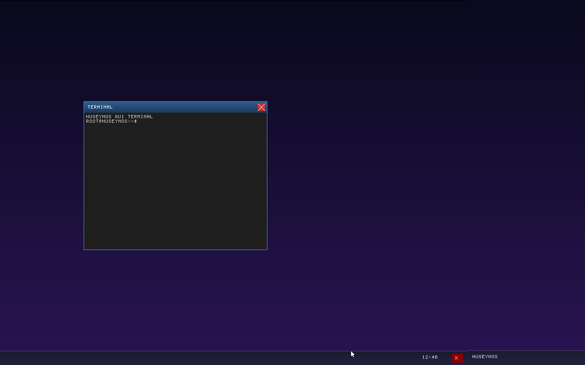

<div align="center">
  <h1>🛡️ HuseynOS</h1>
  <p><strong>A modern, formally-inspired 64-bit operating system built entirely from scratch in Rust, leveraging a pure microkernel architecture for maximum safety and efficiency.</strong></p>
  
  
</div>

**About the Author:** This operating system was developed completely from scratch by **Huseyn Verdiyev**, a 15-year-old high school student from Azerbaijan with a deep passion for low-level systems engineering and memory-safe architectures.

**Description:** HuseynOS is an educational operating system built to tackle the inherent security and stability issues of monolithic kernels by strictly isolating device drivers and GUI services into unprivileged Userland processes. It demonstrates how modern memory-safe languages like Rust can be utilized at the bare-metal level to create highly resilient, fault-tolerant architectures without sacrificing performance.

---

## 🏗️ How It Was Built

I built this project **100% from scratch**. I didn't use any external OS templates, and I didn't even use the Rust standard library (`#![no_std]`). Everything you see—from the boot process and memory allocation to the graphical interface—was coded from the ground up.

* **Microkernel Design:** Unlike monolithic kernels such as Linux or Windows, my OS strictly follows the microkernel philosophy: the core kernel is intentionally minimal, handling only essential memory management and task scheduling. Everything else runs safely as isolated programs. Device drivers (like the mouse and keyboard) and the Graphical Compositor run as completely separate, unprivileged programs. If the mouse driver crashes, the whole OS doesn't panic.
* **Memory Safety:** By writing this in Rust, I'm using the language's strict ownership rules right at the hardware level. This naturally prevents common bugs like segmentation faults and memory leaks.
* **Custom GUI:** The window system uses a Server-Side Compositor. It maps the physical screen into memory, pre-calculates the background to stop screen-tearing, and uses a message-passing system to figure out where your mouse is clicking.

---

## ✨ Features So Far (Phase 9)

* **Preemptive Multitasking:** The OS uses the hardware timer (PIT) to forcefully pause and switch between running programs, so they don't have to wait for each other.
* **Working Desktop Environment:** You can drag windows around by their title bars, click on them to bring them to the front (Z-order focus), and close them safely using IPC messages.
* **Real-Time Clock:** The taskbar reads the actual time directly from the motherboard's CMOS.
* **Memory Paging:** It uses a 4-level paging system and a custom physical page allocator to manage RAM dynamically.

---

## 🧠 Tech Stack

* **Language:** Rust (Nightly, `#![no_std]`)
* **Bootloader:** Limine
* **Emulation:** QEMU
* **Executables:** Custom ELF64 loader
* **Filesystem:** FAT12 RAM-disk

---

## 🛠️ How to Run It

Want to try it yourself? Just make sure you have Rust, Python, and QEMU installed.

```bash
# 1. Setup Rust
rustup default nightly
rustup component add rust-src
rustup target add x86_64-unknown-none

# 2. Build and run (my Python script handles everything)
python build.py run
```

---

## 🗺️ What's Next?

I've got big plans for the future of HuseynOS:
* Adding real hard drive support (FAT32 and ext4).
* Writing a TCP/IP network stack to get it online.
* Supporting user-mode applications and porting 3rd party tools.
* Unlocking true multi-core processing (SMP).

---
*Built with ❤️ in Rust by Huseyn Verdiyev.*
